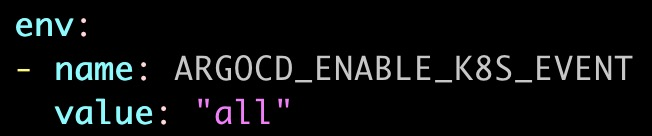
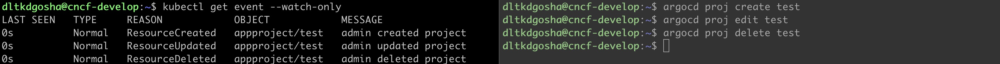
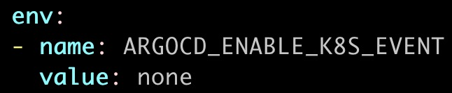
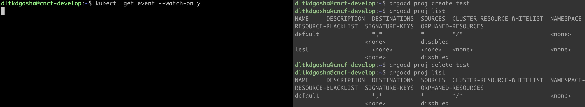
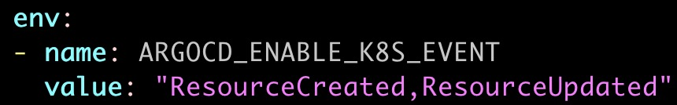
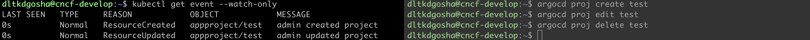

# [ISSUE-18205](https://github.com/argoproj/argo-cd/issues/18205) - option to disable writing k8s events

## PR 제출 여부
- [x] [PR](https://github.com/argoproj/argo-cd/pull/18441)

## 연관 이슈/PR
* [ArgoCD/ISSUE-10529](https://github.com/argoproj/argo-cd/issues/10529)
* [ArgoCD/ISSUE-18310](https://github.com/argoproj/argo-cd/issues/18310)

## 이슈 내용
argocd를 대규모로 사용하는 경우, argocd가 생성하는 k8s event로 인해 `etcd cluster`에 상당한 부하를 가중.\
k8s event를 옵션을 통해 제어 할 수 있는 방법이 필요.\
`ISSUE-10529`는 argocd가 스스로 발행한 일정 주기로 k8s event를 지우길 원하지만 관리적 측면에서 argocd가 직접 etcd의 k8s event를 지우는건 좋지 않다고 판단.\
`ISSUE-18310`에서는 k8s event에 기록하던 app spec의 정보가 디버깅에 큰 효과가 없다고 판단 제거 된 상태.\
해당 이슈와 연관된 이슈를 종합, k8s event의 Reason에 따라 on/off 가능하도록 결정함.

### 구현 목록
- [x] argocd audit logger 변경
- [x] audit logger 참조 부분 변경
- [x] config에 따른 k8s event test 작성

## 문제 해결
### 영향 범위 확인
* **ArgoCD k8s Event Logging 주체**
  * util/argo/audit_logger.go
	>```go
	>type AuditLogger struct
	>```
* **AuditLogger 의존관계**
  * server/application/application.go, server/applicationset/applicationset.go, server/project/project.go
	>```go
	>type Server struct {
	>...
	>	auditLogger *argo.AuditLogger
	>}
  * controller/application.go
	>```go
	>type ApplicationController struct {
	>...
	>	auditLogger *argo.AuditLogger
	>}
### 구현 과정

결정된 방향인 k8s event의 Reason에 따라 on/off, `util/argo`의 `audit_logger.go`에서 argocd의 EventReason 확인, 총 7개 존재.\
옵션 설정의 복잡성을 피하기 위해 EventReason별 Env,Arg를 구현함.\
PR의 리뷰에서 [maintainer comment](https://github.com/argoproj/argo-cd/pull/18441#pullrequestreview-2097407059)에 따라 옵션을 하나로 설정하고 인자로 list로 받게 변경함.\
개인적으로 단일 옵션 변경이 더 깔끔해 보이나 옵션의 인자로 `all`, `none`, `Reason`을 기입해야하는 부분에 대해서 사용자가 명확히 EventReason을 학습해야해서 비직관이 올라간것 같아 아쉬움.

### Result
* argocd-server env all

	
	

* argocd-server env none

	
	

* argocd-server env specific

	
	

## 학습 내용
### EventReason
아래의 argocd가 event 발행시 사용하는 7가지 EventReason을 통해 각 `audit logger` 호출 부분만 보면 해당 로직이 무엇을 하는지 유추가 가능해짐.
```golang
const (
	EventReasonStatusRefreshed    = "StatusRefreshed"
	EventReasonResourceCreated    = "ResourceCreated"
	EventReasonResourceUpdated    = "ResourceUpdated"
	EventReasonResourceDeleted    = "ResourceDeleted"
	EventReasonResourceActionRan  = "ResourceActionRan"
	EventReasonOperationStarted   = "OperationStarted"
	EventReasonOperationCompleted = "OperationCompleted"
)
```

### k8s Event
이번 이슈를 해결하면서 처음으로 k8s event 구조체를 확인함.\
특히 인상 깊었던 부분은 Event의 Name을 조합시, `UnixNano`를 통해 Event를 생성하는 부분이었음.\
쿠버네티스의 다양한 audit logging할때 참조 할 만하다고 생각함, 그 이유는 etcd에서 조회를 할때 시간에 따른 range 검색이 용이하다고 판단.
```golang
func (l *AuditLogger) logEvent(objMeta ObjectRef, gvk schema.GroupVersionKind, info EventInfo, message string, logFields map[string]string) {
	...
	event := v1.Event{
		ObjectMeta: metav1.ObjectMeta{
			Name:        fmt.Sprintf("%v.%x", objMeta.Name, t.UnixNano()),
			Annotations: logFields,
		},
		Source: v1.EventSource{
			Component: l.component,
		},
		InvolvedObject: v1.ObjectReference{
			Kind:            gvk.Kind,
			Name:            objMeta.Name,
			Namespace:       objMeta.Namespace,
			ResourceVersion: objMeta.ResourceVersion,
			APIVersion:      gvk.GroupVersion().String(),
			UID:             objMeta.UID,
		},
		FirstTimestamp: t,
		LastTimestamp:  t,
		Count:          1,
		Message:        message,
		Type:           info.Type,
		Reason:         info.Reason,
	}
	logCtx.Info(message)
	_, err := l.kIf.CoreV1().Events(objMeta.Namespace).Create(context.Background(), &event, metav1.CreateOptions{})
	if err != nil {
		logCtx.Errorf("Unable to create audit event: %v", err)
		return
	}
}
```